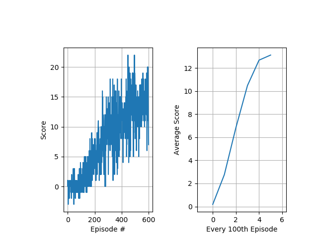

[//]: # (Image References)

[image1]: https://user-images.githubusercontent.com/10624937/42135619-d90f2f28-7d12-11e8-8823-82b970a54d7e.gif "Trained Agent"

# Project 1 : Navigation
## Nagaraju Budigam

### Project Details

In this project, I have trained an agent to navigate (and collect bananas!) in a large, square world.  

![Trained Agent][image1]

A reward of +1 is provided for collecting a yellow banana, and a reward of -1 is provided for collecting a blue banana.  Thus, the goal of the agent is to collect as many yellow bananas as possible while avoiding blue bananas.  

The state space has 37 dimensions and contains the agent's velocity, along with ray-based perception of objects around agent's forward direction.  Given this information, the agent has to learn how to best select actions.  Four discrete actions are available, corresponding to:
- **`0`** - move forward.
- **`1`** - move backward.
- **`2`** - turn left.
- **`3`** - turn right.

The task is episodic, and in order to solve the environment, the agent must get an average score of +13 over 100 consecutive episodes.

### Learning Algorithm

I used [Deep Double Q-learning Algorithm] to develop an agent to interact with the environemtn and learn. It has been shown that Deep Double Q-learning algorithm not only offers better performance but also reduces the observed overestimation. Please find the implementation in [doubledqn.py](doubledqn.py).

References:
1. https://arxiv.org/abs/1509.06461
2. https://github.com/dusty-nv/jetson-reinforcement

### Deep Q-Network Architecture

	----------------------------------------------------------------
	        Layer (type)               Output Shape         Param #
	================================================================
	            Conv1d-1               [-1, 16, 17]             336
	       BatchNorm1d-2               [-1, 16, 17]              32
	            Conv1d-3                [-1, 16, 7]           1,296
	       BatchNorm1d-4                [-1, 16, 7]              32
	            Conv1d-5                [-1, 16, 2]           1,296
	       BatchNorm1d-6                [-1, 16, 2]              32
	            Linear-7                   [-1, 32]           1,056
	            Linear-8                   [-1, 32]           1,056
	            Linear-9                    [-1, 4]             132
	================================================================
	Total params: 5,268
	Trainable params: 5,268
	Non-trainable params: 0
	----------------------------------------------------------------
	Input size (MB): 0.00
	Forward/backward pass size (MB): 0.01
	Params size (MB): 0.02
	Estimated Total Size (MB): 0.03
	----------------------------------------------------------------
  
 
### Training

To train the agent use the below command
	
  python3 doubledqn.py --unity_environmet_file_path=Banana.app

The algorithm has many hyperparameters to tune, however the parameters that I felt best are:

| Parameter     | Value         | 
| ------------- |:-------------:| 
| learning rate |  0.001        |
| replay_memory |  10000        |
| num_history   |     4         |
| num_episodes  |    600        |
| batch_size    |    64         |
| update_every  |    4          |
| gamma         |   0.99        |
| tau           |  0.001        |
| epsilon_start |   1.0         |
| epsilon_end   |     0.01      |
| epsilon_decay |   0.995       |

I used Adam Optimizer and Smooth L1 Loss as the cost functions. The algorithm uses epsilon-greedy policy to select an action, which started at epsilon\_start and annealed to epsilon\_end with the decay as epsilon_start * epsilon\_decay.

References:

1.https://arxiv.org/abs/1412.6980

2.https://en.wikipedia.org/wiki/Huber_loss

The agent was able to solve the environment in 500 episodes Please refer to (checkpoint_solved.pth) file for finding the saved weights.

### Plot of Rewards

#### Training Logs

	INFO:doubledqn:input_width:    37
	INFO:doubledqn:num_actions:    4
	INFO:doubledqn:unity_environmet_file_path:Banana.app
	INFO:doubledqn:pkl_file_name:  scores.pkl
	INFO:doubledqn:learning rate:  0.001
	INFO:doubledqn:replay_memory:  10000
	INFO:doubledqn:num_history:    4
	INFO:doubledqn:num_episodes:   600
	INFO:doubledqn:batch_size:     64
	INFO:doubledqn:update_every:   4
	INFO:doubledqn:gamma:          0.99
	INFO:doubledqn:tau:            0.001
	INFO:doubledqn:epsilon_start:  1.0
	INFO:doubledqn:epsilon_end:    0.01
	INFO:doubledqn:epsilon_decay:  0.995
	INFO:doubledqn:allow_random:   1
	INFO:doubledqn:debug_mode:     0
	INFO:doubledqn:training_mode:  1
	Mono path[0] = '/Users/naga/GitHub/Deep-Reinforcement-Learning/p1_navigation/Banana.app/Contents/Resources/Data/Managed'
	Mono config path = '/Users/naga/GitHub/Deep-Reinforcement-Learning/p1_navigation/Banana.app/Contents/MonoBleedingEdge/etc'
	INFO:unityagents:
	'Academy' started successfully!
	Unity Academy name: Academy
	        Number of Brains: 1
	        Number of External Brains : 1
	        Lesson number : 0
	        Reset Parameters :
			
	Unity brain name: BananaBrain
	        Number of Visual Observations (per agent): 0
	        Vector Observation space type: continuous
	        Vector Observation space size (per agent): 37
	        Number of stacked Vector Observation: 1
	        Vector Action space type: discrete
	        Vector Action space size (per agent): 4
	        Vector Action descriptions: , , , 
	Number of agents: 1
	Number of actions: 4
	INFO:root:Training
	INFO:root:DQN::__init__()
	INFO:root:DQN::__init__()
	Episode 100     Average Score: 0.192    Eps: 0.606
	Episode 200	Average Score: 2.76	Eps: 0.367
	Episode 300	Average Score: 6.83	Eps: 0.222
	Episode 400	Average Score: 10.48    Eps: 0.135
	Episode 500	Average Score: 12.68	Eps: 0.082
	Episode 538	Average Score: 13.00	Eps: 0.067
	Environment solved in 438 episodes!	Average Score: 13.00
	Episode 539	Average Score: 13.03	Eps: 0.067
	Environment solved in 439 episodes!	Average Score: 13.03
	Episode 540	Average Score: 13.05	Eps: 0.067
	Environment solved in 440 episodes!	Average Score: 13.05
	Episode 541	Average Score: 13.03	Eps: 0.066
	Environment solved in 441 episodes!	Average Score: 13.03
	Episode 542	Average Score: 13.02	Eps: 0.066
	Environment solved in 442 episodes!	Average Score: 13.02
	Episode 544	Average Score: 13.04	Eps: 0.065
	Environment solved in 444 episodes!	Average Score: 13.04
	Episode 545	Average Score: 13.11	Eps: 0.065
	Environment solved in 445 episodes!	Average Score: 13.11
	Episode 546	Average Score: 13.10	Eps: 0.065
	Environment solved in 446 episodes!	Average Score: 13.10
	Episode 550	Average Score: 13.02	Eps: 0.063
	Environment solved in 450 episodes!	Average Score: 13.02
	Episode 553	Average Score: 13.04	Eps: 0.063
	Environment solved in 453 episodes!	Average Score: 13.04
	Episode 554	Average Score: 13.06	Eps: 0.062
	Environment solved in 454 episodes!	Average Score: 13.06
	Episode 555	Average Score: 13.00	Eps: 0.062
	Environment solved in 455 episodes!	Average Score: 13.00
	Episode 558	Average Score: 13.06	Eps: 0.061
	Environment solved in 458 episodes!	Average Score: 13.06
	Episode 559	Average Score: 13.14	Eps: 0.061
	Environment solved in 459 episodes!	Average Score: 13.14
	Episode 560	Average Score: 13.16	Eps: 0.060
	Environment solved in 460 episodes!	Average Score: 13.16
	Episode 561	Average Score: 13.14	Eps: 0.060
	Environment solved in 461 episodes!	Average Score: 13.14
	Episode 562	Average Score: 13.07	Eps: 0.060
	Environment solved in 462 episodes!	Average Score: 13.07
	Episode 563	Average Score: 13.20	Eps: 0.059
	Environment solved in 463 episodes!	Average Score: 13.20
	Episode 564	Average Score: 13.21	Eps: 0.059
	Environment solved in 464 episodes!	Average Score: 13.21
	Episode 565	Average Score: 13.19	Eps: 0.059
	Environment solved in 465 episodes!	Average Score: 13.19
	Episode 566	Average Score: 13.20	Eps: 0.059
	Environment solved in 466 episodes!	Average Score: 13.20
	Episode 567	Average Score: 13.25	Eps: 0.058
	Environment solved in 467 episodes!	Average Score: 13.25
	Episode 568	Average Score: 13.20	Eps: 0.058
	Environment solved in 468 episodes!	Average Score: 13.20
	Episode 569	Average Score: 13.22	Eps: 0.058
	Environment solved in 469 episodes!	Average Score: 13.22
	Episode 570	Average Score: 13.15	Eps: 0.057
	Environment solved in 470 episodes!	Average Score: 13.15
	Episode 571	Average Score: 13.17	Eps: 0.057
	Environment solved in 471 episodes!	Average Score: 13.17
	Episode 572	Average Score: 13.20	Eps: 0.057
	Environment solved in 472 episodes!	Average Score: 13.20
	Episode 573	Average Score: 13.19	Eps: 0.057
	Environment solved in 473 episodes!	Average Score: 13.19
	Episode 574	Average Score: 13.17	Eps: 0.056
	Environment solved in 474 episodes!	Average Score: 13.17
	Episode 575	Average Score: 13.16	Eps: 0.056
	Environment solved in 475 episodes!	Average Score: 13.16
	Episode 576	Average Score: 13.20	Eps: 0.056
	Environment solved in 476 episodes!	Average Score: 13.20
	Episode 577	Average Score: 13.19	Eps: 0.055
	Environment solved in 477 episodes!	Average Score: 13.19
	Episode 578	Average Score: 13.23	Eps: 0.055
	Environment solved in 478 episodes!	Average Score: 13.23
	Episode 579	Average Score: 13.19	Eps: 0.055
	Environment solved in 479 episodes!	Average Score: 13.19
	Episode 580	Average Score: 13.19	Eps: 0.055
	Environment solved in 480 episodes!	Average Score: 13.19
	Episode 581	Average Score: 13.15	Eps: 0.054
	Environment solved in 481 episodes!	Average Score: 13.15
	Episode 582	Average Score: 13.15	Eps: 0.054
	Environment solved in 482 episodes!	Average Score: 13.15
	Episode 583	Average Score: 13.16	Eps: 0.054
	Environment solved in 483 episodes!	Average Score: 13.16
	Episode 584	Average Score: 13.09	Eps: 0.054
	Environment solved in 484 episodes!	Average Score: 13.09
	Episode 585	Average Score: 13.17	Eps: 0.053
	Environment solved in 485 episodes!	Average Score: 13.17
	Episode 586	Average Score: 13.26	Eps: 0.053
	Environment solved in 486 episodes!	Average Score: 13.26
	Episode 587	Average Score: 13.23	Eps: 0.053
	Environment solved in 487 episodes!	Average Score: 13.23
	Episode 588	Average Score: 13.24	Eps: 0.052
	Environment solved in 488 episodes!	Average Score: 13.24
	Episode 589	Average Score: 13.27	Eps: 0.052
	Environment solved in 489 episodes!	Average Score: 13.27
	Episode 590	Average Score: 13.34	Eps: 0.052
	Environment solved in 490 episodes!	Average Score: 13.34
	Episode 591	Average Score: 13.31	Eps: 0.052
	Environment solved in 491 episodes!	Average Score: 13.31
	Episode 592	Average Score: 13.34	Eps: 0.051
	Environment solved in 492 episodes!	Average Score: 13.34
	Episode 593	Average Score: 13.39	Eps: 0.051
	Environment solved in 493 episodes!	Average Score: 13.39
	Episode 594	Average Score: 13.38	Eps: 0.051
	Environment solved in 494 episodes!	Average Score: 13.38
	Episode 595	Average Score: 13.29	Eps: 0.051
	Environment solved in 495 episodes!	Average Score: 13.29
	Episode 596	Average Score: 13.32	Eps: 0.050
	Environment solved in 496 episodes!	Average Score: 13.32
	Episode 597	Average Score: 13.29	Eps: 0.050
	Environment solved in 497 episodes!	Average Score: 13.29
	Episode 598	Average Score: 13.21	Eps: 0.050
	Environment solved in 498 episodes!	Average Score: 13.21
	Episode 599	Average Score: 13.13	Eps: 0.050
	Environment solved in 499 episodes!	Average Score: 13.13
	Episode 600	Average Score: 13.12	Eps: 0.049
	
	Environment solved in 500 episodes!	Average Score: 13.12

### Testing

To test the agent use below command. 

	python3 doubledqn.py --unity_environmet_file_path=Banana.app --training_mode=0

The agent was able to obtain 18 rewards on the test environment.

#### Testing Logs

	Nagarajus-MacBook-Pro:p1_navigation naga$ python3 doubledqn.py --unity_environmet_file_path=Banana.app --training_mode=0
	INFO:doubledqn:input_width:    37
	INFO:doubledqn:num_actions:    4
	INFO:doubledqn:unity_environmet_file_path:Banana.app
	INFO:doubledqn:pkl_file_name:  scores.pkl
	INFO:doubledqn:learning rate:  0.001
	INFO:doubledqn:replay_memory:  10000
	INFO:doubledqn:num_history:    4
	INFO:doubledqn:num_episodes:   600
	INFO:doubledqn:batch_size:     64
	INFO:doubledqn:update_every:   4
	INFO:doubledqn:gamma:          0.99
	INFO:doubledqn:tau:            0.001
	INFO:doubledqn:epsilon_start:  1.0
	INFO:doubledqn:epsilon_end:    0.01
	INFO:doubledqn:epsilon_decay:  0.995
	INFO:doubledqn:allow_random:   1
	INFO:doubledqn:debug_mode:     0
	INFO:doubledqn:training_mode:  0
	Mono path[0] = '/Users/naga/GitHub/Deep-Reinforcement-Learning/p1_navigation/Banana.app/Contents/Resources/Data/Managed'
	Mono config path = '/Users/naga/GitHub/Deep-Reinforcement-Learning/p1_navigation/Banana.app/Contents/MonoBleedingEdge/etc'
	INFO:unityagents:
	'Academy' started successfully!
	Unity Academy name: Academy
	        Number of Brains: 1
	        Number of External Brains : 1
	        Lesson number : 0
	        Reset Parameters :
			
	Unity brain name: BananaBrain
	        Number of Visual Observations (per agent): 0
	        Vector Observation space type: continuous
	        Vector Observation space size (per agent): 37
	        Number of stacked Vector Observation: 1
	        Vector Action space type: discrete
	        Vector Action space size (per agent): 4
	        Vector Action descriptions: , , , 
	Number of agents: 1
	Number of actions: 4
	INFO:root:Testing
	INFO:root:DQN::__init__()
	INFO:root:DQN::__init__()
	Score: 18.0

### Ideas for Future Work

In this project, I trained an agent using Deep Double Q-learning algorithm. As a state, I used the pre-defined 37 input features, that stack up with history and a convolution neural network (CNN), the bottom part of a DNN learns a rich representation for the problem. 

Therefore, learning from pixels is another alternative one could experiment with. It has been shown that a family of DQN algorithms have shown super-human performance leaning from raw pixels. 

In addition to DDQN, I would love to experiment with the next generation of DQNs, such as [Dueling Network Architectures](https://arxiv.org/abs/1511.06581), [Dynamic Frame skip Deep Q Network](https://arxiv.org/pdf/1605.05365.pdf), [Rainbow](https://arxiv.org/pdf/1710.02298.pdf), [Deep Recurrent Q-Learning](https://arxiv.org/pdf/1507.06527.pdf). 

In addition, I would also hypothesis that I woulduse both hand crafted features and raw pixel as inputs to further experiment with and solve the problem similar to [Siamese Neural Networks](https://www.cs.cmu.edu/~rsalakhu/papers/oneshot1.pdf) for example. 
